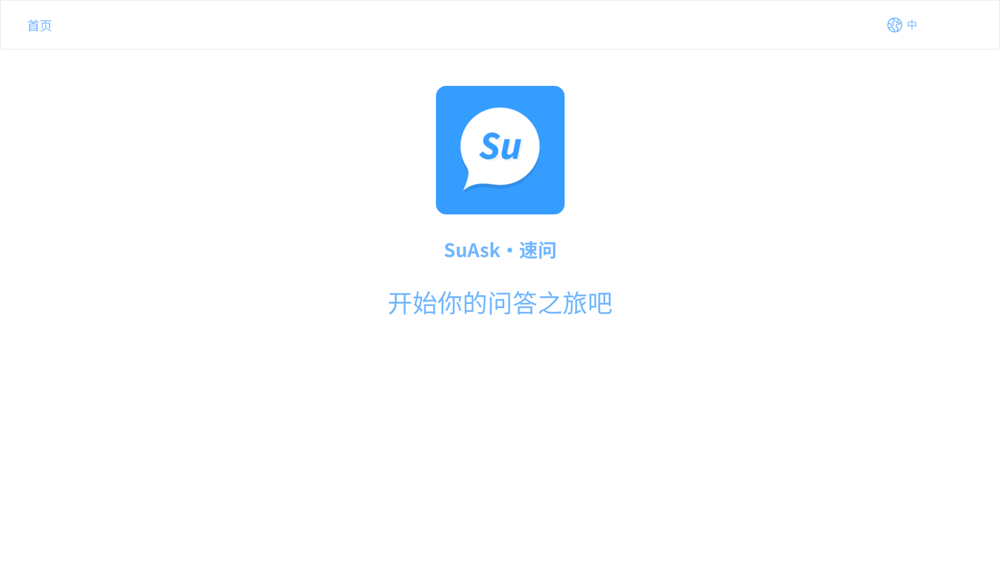
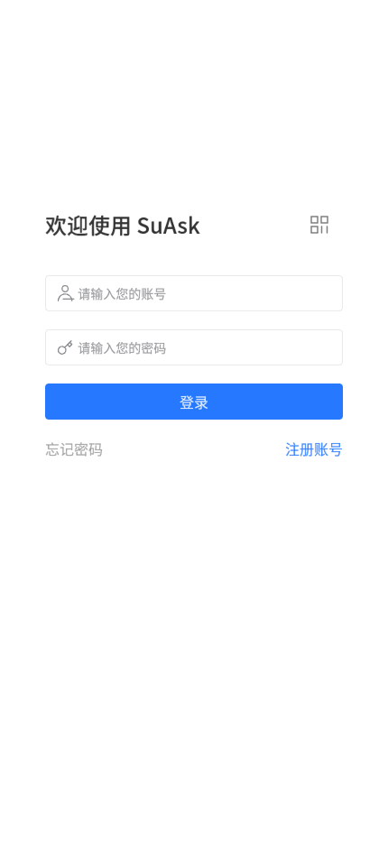
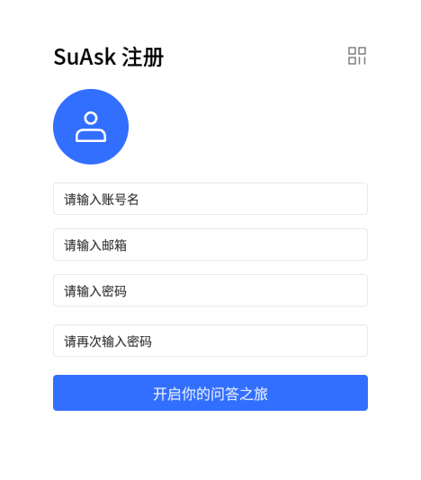
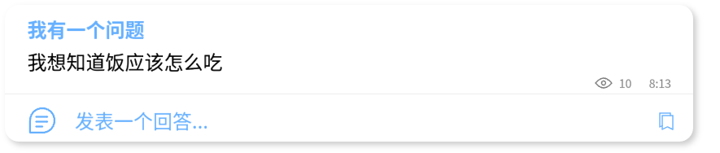
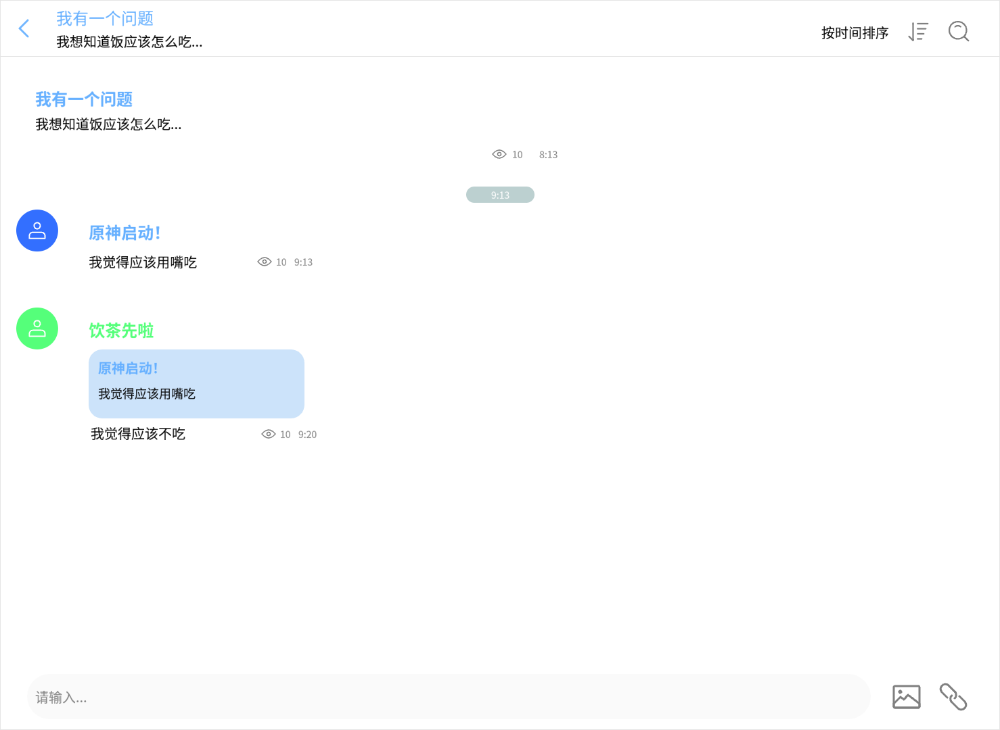
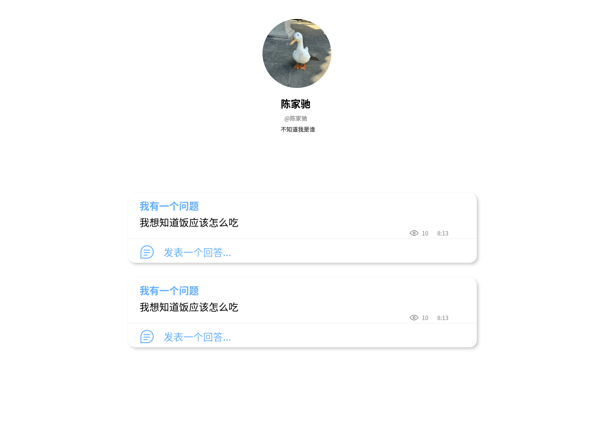
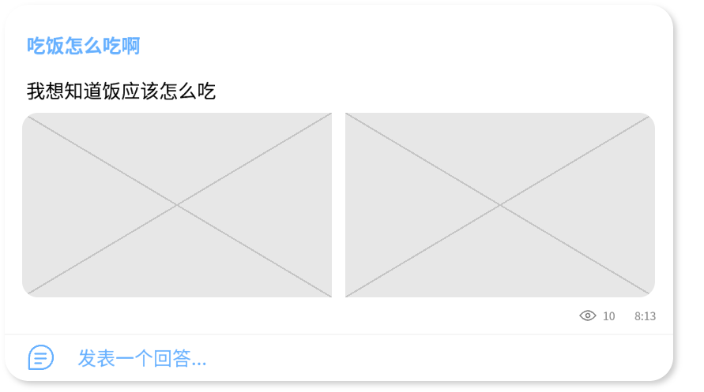
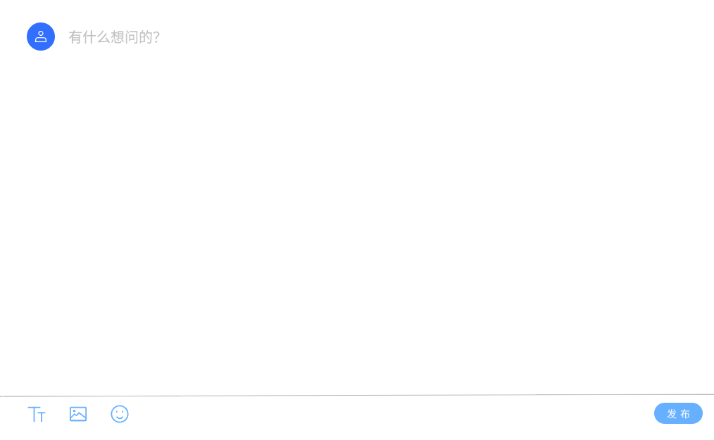

# 需求分析

## 用户组
暂时确定为三个用户等级，分别为

- 管理员

管理员拥有最高权限，包括对后台数据的完全管理

- 教师

教师暂时不能选择性删除自己回答下面的提问，可以联系管理员删除

教师拥有标识自己身份的昵称颜色（暂定为蓝色）

- 学生

学生可以进行提问和回答，每天最多提问3次

## 基础功能

### 主页面

进入`suask.me`时，显示主页面

### 登录

支持学生用户通过邮箱进行注册，教师用户可以通过后台认证进行注册，管理员只能通过后台注册

支持用户在注册时自定义头像、账号，同时设置密码，密码加密后存在数据库，可以通过邮箱重设

用户拥有账号和昵称两种名称，初次注册时仅支持注册账号，学生账号限制为大小写字母和_组成，不可重名（包括已注销的账户），昵称可以完全自定义

教师账号为本人中文姓名，由后台统一注册，教师昵称可以自定义

登录界面和注册界面：

 

### 匿名系统

提出的问题均会进行匿名处理，回复问题不会进行匿名

在问题界面不会显示提问者

### 提问

提问分为向教师提问(**问教师**)和向大家提问(**问大家**)

选择**问教师**时，问题可以选择私密或公开，私密即仅提问者和被提问者可以查看，公开即收到回复后就展示在**问大家**上

选择**问教师**时，提问者有追问功能，老师可以继续回复（聊天），其他用户不能回复

选择**问大家**时，问题默认公开

被提问者收到提问、提问者收到回复或回答者收到回复时，会自动提醒，提醒精确到问题

教师可以置顶提问，学生可以收藏提问，均按置顶（收藏）时间排序

教师用户只支持看大家的提问，不支持自己进行提问

不支持普通用户进行删除修改自己提问的操作

### 回答

回答分为教师回答(**教师答**)和大家回答(**大家答**)

教师在遇到重复问题时，可以通过下拉框（搜索并）选择引用自己之前的回答，选中后自动插入超链接到回答内容中，点击即可跳转到教师过去的回答

例如：
> [该怎么样吃饭？
> 苏老师：用嘴吃，然后...](https://www.bilibili.com/video/BV1UT42167xb)

大家答不包含引用回复功能

回答可以对他人的回答进行回复，只支持回复一条内容，不支持回复嵌套

不支持普通用户进行删除修改自己回答的操作

### 个人界面

个人界面将会展示用户的头像、昵称和账号

允许用户自定义个人简介，不启用**富文本**功能时，简介居中，启用**富文本**，简介向左对齐

教师个人界面将会展示其置顶的提问

### 主题（背景图）

官方提供背景图，可以在设置里面进行设置

### 图片

支持用户在回答和提问时插入图片，图片将直接展示，类似于微信朋友圈的九宫格形式，用户一次仅允许选择9张图片，最多支持上传36张图片，图片展示仅展示9张，其它图片使用抽屉方式查看

支持用户在启用**富文本**功能时自己插入外链图片，外链图片不会展示在问题页，但是可以插入在文字中间

### 检索和排序置顶功能

- 检索
    用户可以搜索问题和回答
- 排序
    用户可以选择`按热度`、`按点赞量`或`按时间`对问题进行排序，选择`按点赞量`或`按时间`对回答进行排序。热度即浏览量，在用户每次点击查看问题时自增，不进行去重
- 置顶
    教师可以在自己的主页置顶自己的一些回答

### 富文本支持

支持以`markdown`格式的文本，用户需要自行点击按钮来开启

目前集成在个人简介、提问中，提问不支持富文本标题`#`

## 额外功能

### 夜间模式

可以根据系统自动条件界面的颜色

### 表情包系统

官方提供一些表情包，用户可以使用表情包贴在回复或回答下面

### i18n国际化

可以留出i18n接口，平时编码时尽量不要把文字内容硬编码写死在程序中
